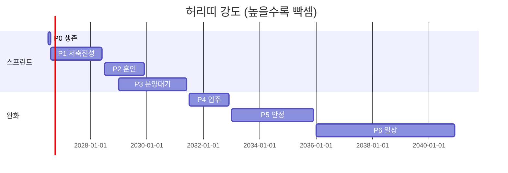

# 인생 플랜 — 운정 59형 · 2인 가구 (2026-06)

> Excel: [`sheets/인생플랜.xlsx`](../sheets/인생플랜.xlsx) · [`sheets/종합인생라인.xlsx`](../sheets/종합인생라인.xlsx)  
> Canvas: [`canvases/life-line.canvas.tsx`](../canvases/life-line.canvas.tsx) (Cursor에서 열기)  
> 상수: [`config/life_plan.py`](../config/life_plan.py)

---

## 한 줄 답: 허리띠 언제까지?

**죽을 때까지 아님.**  
지금~2031 입주 전까지가 **집 사기 스프린트**(월 여유 거의 0).  
**2031~32 입주**하면 집마련 저축이 끊기고 **월 ~63만 여유**가 생김 (관리비 포함).  
**2033~34**부터 용돈·외식·취미를 다시 키우는 **일상 모드**로 전환.

| 구간 | 기간 | 허리띠 | 월 여유 |
|------|------|--------|--------:|
| P0 생존 | 2026.07 | 최대 | ~61만 (CMA) |
| P1 저축전성 | 2026.08~2028 상반기 | 빡셈 | **0** |
| P2 혼인·비자 | 2028 하반기~2029 | 빡셈+이벤트 | 0 (예식 일회성) |
| P3 분양·대기 | 2029~2031 입주 전 | 유지 | 2029.06 카카오 끝 **+9.2만** |
| P4 입주 전환 | 2031~2032 | **완화 시작** | **~63만** |
| P5 안정 | 2033~2035 | 숨 쉼 | 60~65만 → 용돈·식비 업 |
| P6 중장기 | 2036~ | 일상 | 소득 성장·연금은 백그라운드 |



---

## 핵심 원칙

| 구분 | 어디에 둘까 |
|------|------------|
| **급여·고정비** | **KB 주거래 1개** (급여 들어오고 결제도 여기서) |
| **집마련** | **보통예금 X** → **CMA·파킹** (이자) — **2031 입주 시 중단** |
| **ISA** | 계약금 2순위 (세제) |
| **연금** | 세금 깎기만 (집값 X) — 입주 후에도 소액 유지 가능 |

---

## 통장 구조 (11개)

### 현철 — 6개

| 통장 | 금융사 | 월 |
|------|--------|---:|
| **급여·고정비** | KB 주거래 | 급여 250만 · **상시 85만** 유지 |
| **집마련** | **삼성증권 CMA** | **~38만** (P4까지) |
| 용돈 | KB/토스 | 15만 |
| ISA | 증권 | 50만 |
| 연금 | 연금저축 | 20만 |
| 청약 | 기존 | 2만·640만 유지 |

### 여친 — 4개 (8월~)

| 통장 | 금융사 | 월 |
|------|--------|---:|
| **급여·고정비** | 알바 은행 | 급여 190만 · **상시 48만** |
| **집마련** | **토스뱅크 파킹** | **~95만** (P4까지) |
| 용돈 | 토스 | 10만 |
| 비자·비상 | 토스 등 | 5만 |

### 공동 — 1개

| 통장 | 월 |
|------|---:|
| 식비 (장보기) | 75만 |

---

## 월 현금흐름 비교

| | 지금 (P1) | 입주 후 (P4) |
|--|--:|--:|
| 세후 수입 | 440만 | 440만 |
| 고정비 | 132만 | 187만 (월세→대출+관리) |
| 식비+용돈 | 100만 | 100만 |
| 저축 | **208만** (집 133 포함) | **75만** (ISA+연금+비자) |
| **남는 돈** | **0** | **~63만** |

입주 후 월세 60만이 대출 115만+관리 15만으로 바뀌지만, **집마련 133만 저축이 사라져서** 체감은 **한 달에 60만대 더 넉넉**해짐.

---

## 집 살 때 어디서 꺼내나

1. **삼성 CMA + 토스 파킹** (집마련)
2. **ISA** (2029 계약금)
3. 연금저축 (최후·16.5%)

---

## 7월 · 8월 분배

7월: 현철 250만만 · 건보 제외 · ISA/연금 보류 · 잔액 CMA.

8월~: 세후 440만 · 저축 **~207.8만** (ISA 50 + 연금 20 + 비자 5 + 집마련 132.8).

```powershell
python scripts/build_life_plan_xlsx.py
```

Excel 시트:

| 시트 | 내용 |
|------|------|
| **라이프페이즈** | 허리띠 단계 |
| **입주후저축** | 지금 vs 입주 후·대출 원금/이자·여유금 배분 |
| **출산시나리오** | 소득 연 4% 성장·2033 출산 등 6가지·연도별 투영 |
